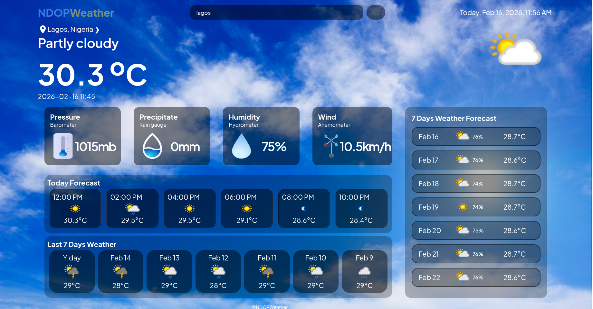
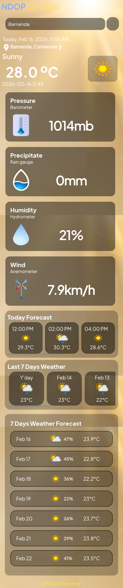

# Weather App
This is a Weather web app built using **HTML, CSS** and **JS**. It shows real time weather data i.e current weather, weather forecast hourly for the day, weather history for the past 7 days and next 7 days weather forecast. It's uses weatherapi to fetch the data and store in a json file which is then manipulated in the JS and also it also the fetch the user current location using ipapi, though it is not very accurate.

---
## Project Architecture
```text
.weather-app
|_assets/.jpes's, .png's
|__style.css
|__index.html
|__script.js

```
---
## Preview and How to Use
open the index.html from GitHub or you can open the deployed link to use it.
- Link : [https://komoforbrandon.github.io/Weather-App/]

---
## Example Output
Desktop View


Mobile View



---
## Built With
- HTML
- CSS
- JS
- with IDE VS Code

---
## Features
- Clean outputs and layout
- Mobile Responsive
- Clean and uniform multiple backgound color
- Attractive UI

---
## Author
- Name: **Komofor Brandon**
- Github: [https://github.com/komoforbrandon]

---
## Acknowledgements
After a thorough 3 weeks of intensive JS classes with **Mr. Wadinga Leonard Ngonga** at **Rebase Code Camp**.I learned JS DOM management and manipulation, API fetching and other topics like asychronous functions. With all this knowledge plus my HTML and CSS skills I was able to built this weather app.Thanks to Rebase Code Camp.
